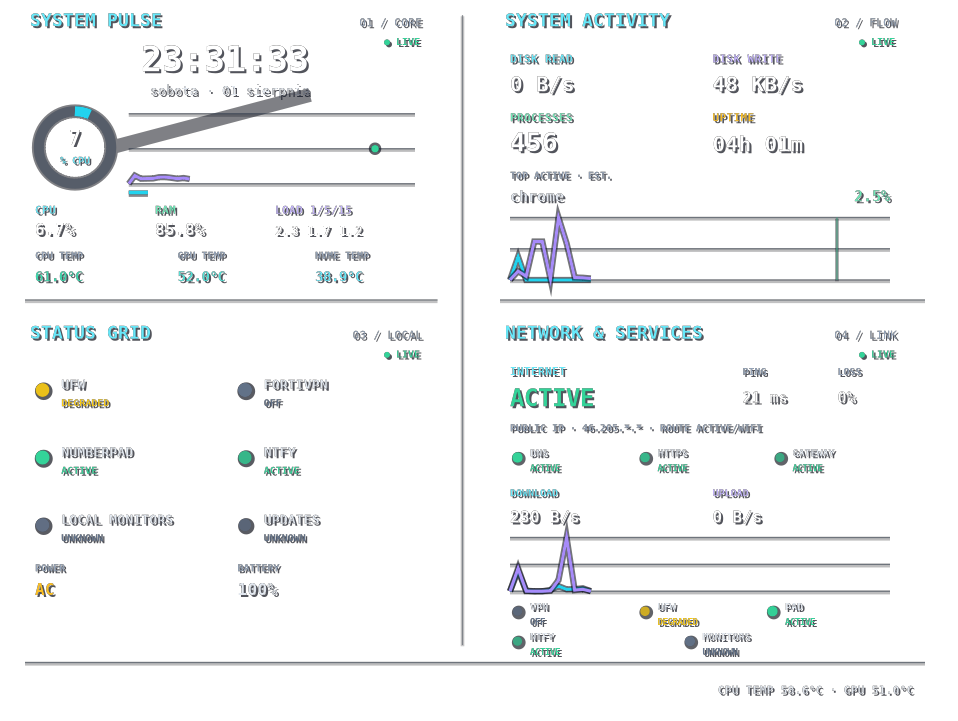
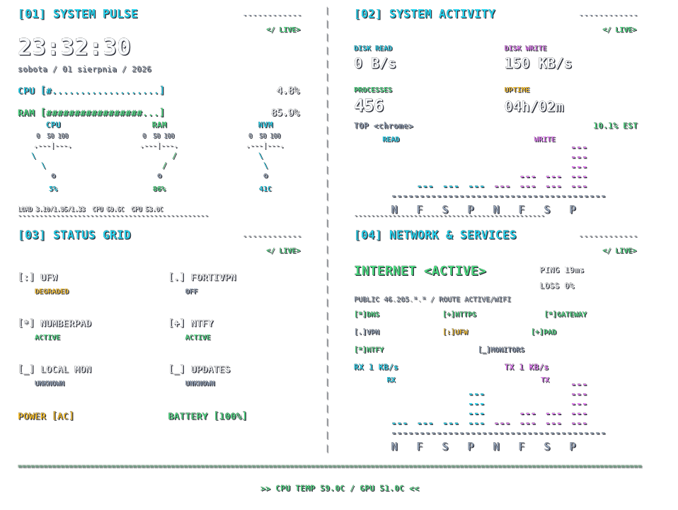

# Bhola Pulse

[](https://github.com/lbudzynowski/bhola-pulse/actions/workflows/ci.yml)
[](https://github.com/lbudzynowski/bhola-pulse/releases/latest)
[](LICENSE)

Bhola Pulse is an animated system-telemetry dashboard for Ubuntu GNOME on
Wayland/XWayland. It combines one long-lived, standard-library-only Python
provider, one atomic JSON cache, and transparent Conky/Lua/Cairo renderers.

The dashboard remains user-scoped and does not change GNOME, display, VPN,
firewall, or package-manager configuration. A separate, tightly sandboxed
systemd oneshot verifies UFW runtime state read-only; the dashboard itself
never receives firewall capabilities.

## Screenshots

<table>
  <tr>
    <td width="49%">
      <a href="docs/images/large-sharp.png"></a><br>
      <sub>LARGE SHARP — live modern renderer.</sub>
    </td>
    <td width="49%">
      <a href="docs/images/nerd-mode.png"></a><br>
      <sub>NERD MODE — live terminal/BBS renderer.</sub>
    </td>
  </tr>
</table>

## Dashboard

Bhola Pulse renders the same four-section 760×570 dashboard on every monitor
active at startup:

- **System Pulse** — CPU, RAM, load, uptime, temperatures, power, battery, and
  three large meters;
- **Status Grid** — honest local states for UFW, FortiVPN, NumberPad, ntfy, and
  known monitor processes;
- **System Activity** — aggregate disk read/write activity and top-process data;
- **Network & Services** — aggregate RX/TX, route presence, bounded gateway,
  Internet, DNS, HTTPS, and masked public-address probes.

All windows share one provider and one atomically replaced cache. The cache does
not contain interface names, hostnames, process arguments, private URLs,
credentials, or a complete public address.

### Presentation styles

`modern` is the default **LARGE SHARP** presentation with rings, smooth plots,
status points, temperature interpolation, and a moving ticker.

`nerd` keeps the same data and geometry but uses a terminal/BBS presentation:
ASCII bars, fixed NOW/FAST/SLOW/PEAK banks, large character-only CPU/RAM/NVMe
meters, spinner, status pulses, and a terminal ticker.

`cinematic` wraps the unchanged `nerd` renderer with an optional presentation
layer: a short boot sequence, subtle CRT scanlines, HUD corner marks, and a
continuously scrolling 12-line LIVE TRACE below the normal dashboard. The trace
is hidden during the boot sequence, prioritizes real state transitions, and
otherwise emits one rotating cache-derived `PULSE`, `SYS`, `NET`, or `SVC`
snapshot per second. Cinematic also adds infrequent deterministic glitch bursts
that re-render horizontally sliced portions of the real dashboard with chromatic
tearing and noise. Every third burst may briefly reveal an original in-repository
ASCII skull that is torn apart by the same slice effect. The transparent
wallpaper/background behavior is unchanged. The renderer does not invent Git,
APT, or PPA events when no corresponding telemetry source exists.

Select a style for one run:

```bash
bhola-pulse --style modern
bhola-pulse --style nerd
bhola-pulse --style cinematic
BHOLA_STYLE=nerd bhola-pulse
BHOLA_STYLE=cinematic bhola-pulse
```

Save a user preference:

```bash
bhola-pulse config set nerd
bhola-pulse config set cinematic
bhola-pulse config show
bhola-pulse config set modern
bhola-pulse config reset
```

Style precedence is:

1. `--style`;
2. `BHOLA_STYLE`;
3. the saved user preference;
4. `modern`.

The saved preference is stored in
`${XDG_CONFIG_HOME:-~/.config}/bhola-pulse/style`. Runtime state is stored in
`${XDG_STATE_HOME:-~/.local/state}/bhola-pulse/dashboard.json`. Neither path is
removed when the Debian package is uninstalled.

## Install

Download the `.deb` and `SHA256SUMS` from the latest GitHub release, verify the
package, and install it with APT:

```bash
sha256sum --check SHA256SUMS
sudo apt install ./bhola-pulse_0.1.2-1_all.deb
bhola-pulse --check
bhola-pulse
```

Stop the foreground dashboard with `Ctrl+C`. The launcher terminates every Conky
instance and the shared provider and does not leave a daemon behind.

The package depends on:

- Python 3.11 or newer;
- `conky-all` with Lua and Cairo bindings;
- `nftables` for the mandatory read-only UFW runtime probe;
- `xrandr` from `x11-xserver-utils`;
- the X11 client library used by the verified click-through helper.

`ping` is recommended. Missing, stale, or invalid optional signals produce an
honest `unknown` state instead of terminating the dashboard.

### Verified UFW status

The package installs `bhola-pulse-ufw-probe.service` and a 45-second timer.
Only that short root oneshot retains `CAP_NET_ADMIN`; it executes the fixed
read-only command `/usr/sbin/nft --json list ruleset` and atomically writes a
small root-owned summary to `/run/bhola-pulse/ufw-status.json`. It never stores
the ruleset, addresses, ports, interfaces, comments, counters, or raw command
output. The unprivileged collector validates the file before using it.

UFW is rendered as `ok` only for fresh verified active runtime, `degraded` only
for fresh verified inactive runtime while configuration is enabled, `off` for
disabled configuration, and `unknown` when verification is missing, stale,
invalid, timed out, or otherwise inconclusive. See
[the UFW runtime probe design](docs/ufw-runtime-probe.md) for security,
validation, deployment, and rollback details.

## Network and privacy behavior

Network probes run outside the provider loop in a pool capped at two workers.
Each probe has a 2.5-second hard timeout and cannot overlap another invocation
of itself. Gateway runs every 30 seconds, Internet latency/loss every 45
seconds, DNS and HTTPS every 60 seconds, and the public-address lookup at
startup and at most every six hours. A failed refresh retains the last valid
value with its age and a degraded source state.

Public, non-secret defaults live in `config/network-defaults.json`. An optional
machine-local override may be placed in the runtime state directory as
`network.local.json`. Web endpoints must use HTTPS. Tests and CI use injected
fakes and perform no real network traffic.

## Development

Check requirements without launching a window:

```bash
./scripts/run-dev.sh --check
```

Run from the repository:

```bash
./scripts/run-dev.sh
./scripts/run-dev.sh --style nerd
./scripts/run-dev.sh --style cinematic
```

Run all environment-independent checks:

```bash
bash scripts/check.sh
```

Build the Debian package and checksum file:

```bash
bash scripts/build-deb.sh
```

The output is written to `dist/`. Pull-request CI compiles the Python sources,
runs the complete unit-test suite, validates shell syntax, builds the `.deb`,
checks its metadata and checksum, extracts it, and verifies the installed
launcher and payload. A successful version-changing merge to `main` creates the
matching annotated tag and GitHub release when that release does not already
exist.

## Runtime design

The provider schedules fast metrics every second, disk activity every two
seconds, temperatures and the top process every five seconds, power and local
statuses every 12 seconds, and the optional update count no more than hourly.
The current standard-library implementation reports the update count as
`unknown` instead of spawning a package manager or refreshing package metadata.

With one monitor Conky renders every 0.15 seconds. Startup selection increases
the interval to 0.25 seconds for two monitors and 0.35 seconds for three or more.
Monitor discovery occurs once at startup. Automatic recovery after later
monitor hotplug remains an explicit backlog item.

Temperature colors interpolate between cool cyan at 45°C and below, normal
green at 65°C, warm yellow at 75°C, high orange at 85°C, and alarm red at 95°C.
Missing sensors use neutral gray and `N/A`.

## Layout

- `packaging/bhola-pulse` — installed command and persistent style management;
- `packaging/debian/` — Debian package metadata;
- `packaging/systemd/` — capability-bounded UFW probe service and timer;
- `scripts/build-deb.sh` — package and SHA-256 builder;
- `scripts/run-dev.sh` — foreground multi-monitor lifecycle;
- `conky/bhola-pulse.conf` — transparent Conky window and render cadence;
- `conky/bhola_pulse.lua` — style selection and shared scaled draw hook;
- `conky/bhola_render.lua` — `modern` renderer;
- `conky/bhola_render_nerd.lua` — `nerd` renderer;
- `conky/bhola_render_cinematic.lua` — optional cinematic wrapper over `nerd`;
- `src/bhola_provider.py` — provider lifecycle and task composition;
- `src/bhola_collectors.py` — local Linux telemetry sources;
- `src/bhola_network.py` — aggregate counters, route discovery, parsers, and
  bounded probes;
- `src/bhola_probes.py` — two-worker non-overlapping network task manager;
- `src/bhola_services.py` — confidence-aware read-only local service status;
- `src/bhola_ufw_probe.py` — privileged parser and minimal atomic runtime state;
- `src/bhola_clickthrough.py` — one-shot verified XShape input-region helper;
- `src/bhola_monitors.py` — sanitized startup-only active-monitor discovery;
- `src/bhola_style.py` — validated CLI/environment style resolution;
- `tests/` — environment-independent provider, layout, and packaging tests.

## License

Bhola Pulse is released under the [MIT License](LICENSE).
